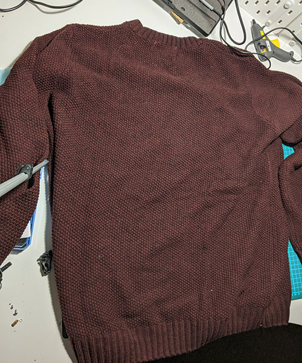
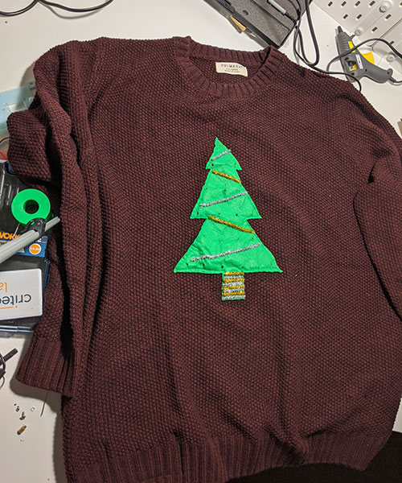

Some of you will be aware that while I'm not necessarily great at it, I enjoy playing around with hardware. One of the talks that I've been fortunate enough to travel the world to give is about using JavaScript to do bits of home automation, including automating my curtains and making my own thermostat.

So it may come as no real surprise that when I heard there was going to be a Christmas jumper competition at work last year, I decided add LEDs to my jumper and connect it to the Internet.
<!-- more -->
## Step 1 - The jumper
I didn't want to start with an off-the-shelf Christmas jumper, that feels a little like cheating. Instead, I decided to get a plain jumper and add my own stuff to it. I went a dark red jumper with a chunky knit from Primark that cost £8.

I then started thinking about what I was going to do for the design. The most obvious idea to me was a Christmas tree, as I could scatter LEDs over it and light it up like an actual Christmas tree.

As I'm no good at sewing and don't possess a sewing machine, I asked [my sister Cerise](https://www.instagram.com/cerisebonaccorsi/) for her help at this stage. I cut a Christmas tree shape out of felt, and she sewed it onto the jumper for me.

Once that was done, I got some sparkly pipe cleaners and used a hot glue gun to attach them to the felt in a tinsel-like design. At this stage I also marked and poked holes in the felt for where the lights would come out.

## Step 2 - The lights